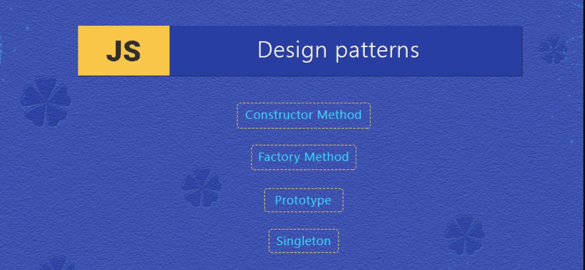

## Artistry of Design Patterns in Software Engineering

Design patterns are the hidden brushstrokes of masterful software engineering, seamlessly weaving elegance and efficiency into the fabric of code. They are recurring solutions to common design problems, offering a blueprint for structuring code that promotes flexibility, scalability, and maintainability. The application of design patterns is akin to an artist selecting the right brushstroke to bring a canvas to life, transforming code into a work of art.

Design patterns can be categorized into three main types: creational, structural, and behavioral. Creational patterns focus on the process of object creation, structural patterns define the composition of classes and objects, and behavioral patterns dictate the ways in which objects interact and communicate. Each pattern serves as a time-tested template, capturing the essence of a specific design challenge and providing a proven solution that can be adapted across various contexts.

Design patterns contribute to the development of robust software by encapsulating best practices and promoting code reuse. They facilitate the creation of modular, maintainable codebases that are less prone to errors and easier to understand. Moreover, design patterns enhance communication among developers by establishing a common language for discussing solutions to common problems. By leveraging design patterns, software engineers can elevate their craft, producing code that transcends the mundane and achieves a level of artistry.

When faced with the challenge of dynamically extending the behavior of objects, the Decorator pattern provided an elegant solution. In a graphical user interface, this pattern allowed me to attach new responsibilities to objects, such as adding borders or scrollbars, without altering their structure. The result was a flexible and composable system where features could be combined like musical notes in a chord, creating a rich and harmonious user experience.

In a command-line application, the Command pattern orchestrated the execution of operations, encapsulating requests as objects. This abstraction enabled the construction of complex command hierarchies, allowing for the implementation of undo/redo functionality seamlessly. Much like a conductor guiding the orchestra through intricate passages, the Command pattern facilitated the precise orchestration of user actions.

Design patterns are the sheet music of software engineering, guiding developers in creating masterful compositions. In my coding endeavors, I have applied these patterns like a skilled composer, weaving intricate melodies of functionality and structure. As we continue to evolve in the realm of software development, embracing the artistry of design patterns becomes not just a best practice but a celebration of craftsmanship—a symphony that resonates through the corridors of code, leaving a lasting impression on both developers and end-users alike.
