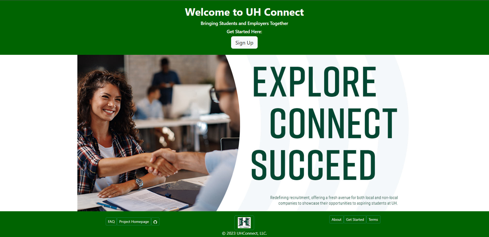

## Overview

UHConnect, a collaborative effort led by  Kyle Takeda, Tanner Berry, Andrew Wan, Vinton Sistoza, and Lloyd Sanderson, stands as a promising web application at the intersection of technology and career development. Developed using the powerful combination of Meteor, React, and MongoDB, this platform serves as a pivotal hub for fostering connections between companies and students within the University of Hawaii (UH) community.

The user interface is meticulously designed to ensure easy navigation for both companies seeking to share job opportunities and students eager to explore these avenues before embarking on their post-graduation journey. Through a thoughtfully crafted interface, the platform aims to bridge the gap between academic pursuits and professional aspirations.

In essence, UHConnect is not merely a job portal; it's a dynamic ecosystem designed to cater to the nuanced needs of both students and companies. By providing a user-centric experience, seamless connections to external websites, optional yet powerful profile creation, and a sophisticated shortlisting mechanism, UHConnect is poised to redefine the landscape of career exploration and recruitment within the University of Hawaii community. As users embark on their UHConnect journey, they'll discover a versatile and empowering platform that transcends traditional job-seeking paradigms.

## Contributions

My significant contribution to the UHConnect project involved orchestrating the organization and layout of the homepage, coupled with the pivotal responsibility of managing roles within the team. This multifaceted role not only provided me with invaluable experience in group management but also afforded me the opportunity to cultivate and refine my skills in orchestrating a collaborative and efficient workflow.

Beyond organizational prowess, my contributions extended to the strategic planning phase, where I played a key role in delineating and establishing the features that would be incorporated into the platform. This involvement in feature selection not only showcased my ability to envision the project's trajectory but also underscored my commitment to shaping a product that seamlessly aligns with the needs of its users.

## GitHub 
Click on the github link to find more inforation about the project.
Source: <a href="https://github.com/uh-connect/uh-connect"><i class="large github icon "></i>GitHub Link!</a>
