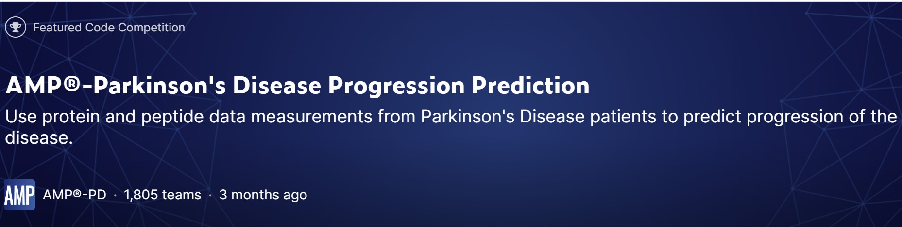

The project undertaken in EE445 served as a pivotal arena for honing our skills in machine learning techniques. In a collaborative effort within designated groups, our focus was directed towards proficiently crafting Python code that employed various machine learning methods. The context of the project was framed by a competition that generously furnished clinical data pertaining to patients exhibiting diverse progressions of Parkinson's disease.

Our collective endeavors were particularly centered around the strategic application of machine learning techniques to glean valuable insights from the provided clinical data. As part of this exploration, we delved into the realm of regression analysis, with a specific emphasis on leveraging the Lasso method. Lasso, distinguished in the machine learning landscape, excels as a regression analysis technique that adeptly combines variable selection and regularization. This dual functionality not only enhances the predictive accuracy of our models but also contributes significantly to their interpretability.

In the development of our machine learning project, I played a pivotal role in enhancing the data preprocessing phase by contributing code segments focused on handling missing values. Recognizing the significance of data integrity, I implemented a robust solution to drop rows containing NaN values from both the training and testing datasets. The code, exemplified by the lines y_train_sparse = y_train.dropna() and x_train_sparse = x_train.loc[y_train_sparse.index], strategically eliminates instances with missing target variable values while preserving the corresponding features. This meticulous approach ensures that our machine learning models are trained and tested on a dataset with complete information, laying a solid foundation for accurate predictions. Furthermore, I extended this data-cleaning process to the testing set with the lines y_test_sparse = y_test.dropna() and x_test_sparse = x_test.loc[y_test_sparse.index], ensuring consistency in our data preprocessing approach. The subsequent application of the Lasso regression model, configured with specific parameters, as showcased in lasso = Lasso(normalize=True, alpha=0.055).fit(x_train, y_train), reflects my commitment to refining the model training process and optimizing its predictive capabilities. The concluding print statement, print(lasso.sparse_coef_), outputs the sparse coefficients of the Lasso model, providing valuable insights into the variable selection and regularization achieved during the training phase. Through these contributions, I aimed to bolster the project's foundation, ensuring that subsequent analyses and model evaluations are built upon a clean and reliable dataset.

The clinical data on Parkinson's disease progression served as a challenging and real-world dataset, offering a fertile ground for us to apply and fine-tune our machine learning skills. Through collaborative coding sessions in Python, we navigated the intricacies of different machine learning methods, with Lasso emerging as a standout approach for its ability to identify crucial variables and optimize model performance.

This project not only enriched our understanding of machine learning techniques but also underscored the practical implications of data-driven decision-making, especially in the context of healthcare. The competition setting added an element of excitement and urgency, mirroring the real-world scenarios where deploying effective machine learning models is time-sensitive and impactful.

## GitHub Link
For those interested in the code and inforation about the project, a link to the github page is provided below.
Source: <a href="https://github.com/cody1444/EE445-Kaggle-Competiton/tree/main"><i class="large github icon "></i>EE445 kaggle competition</a>
